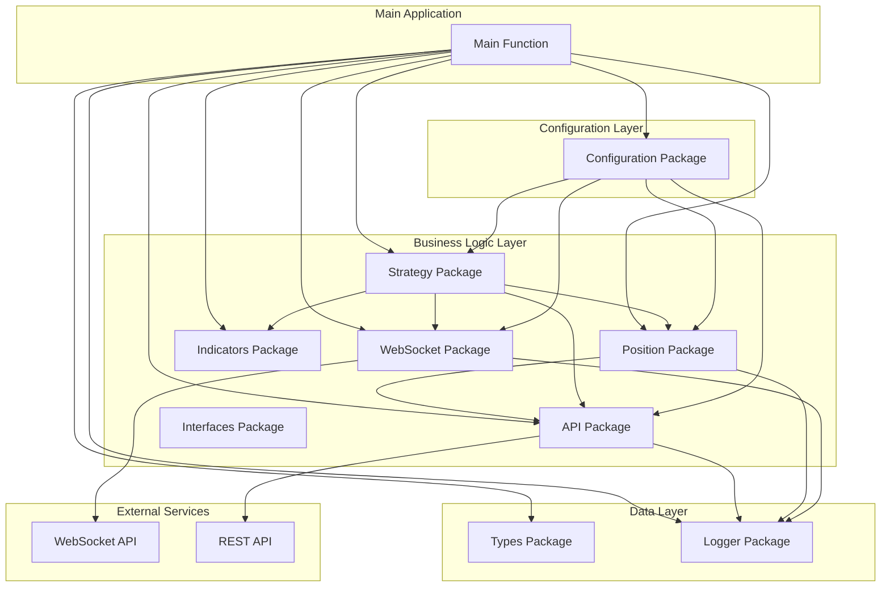
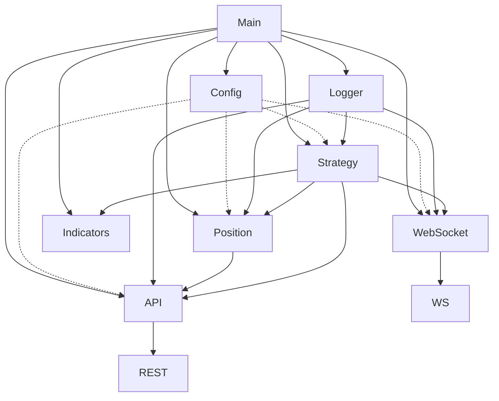
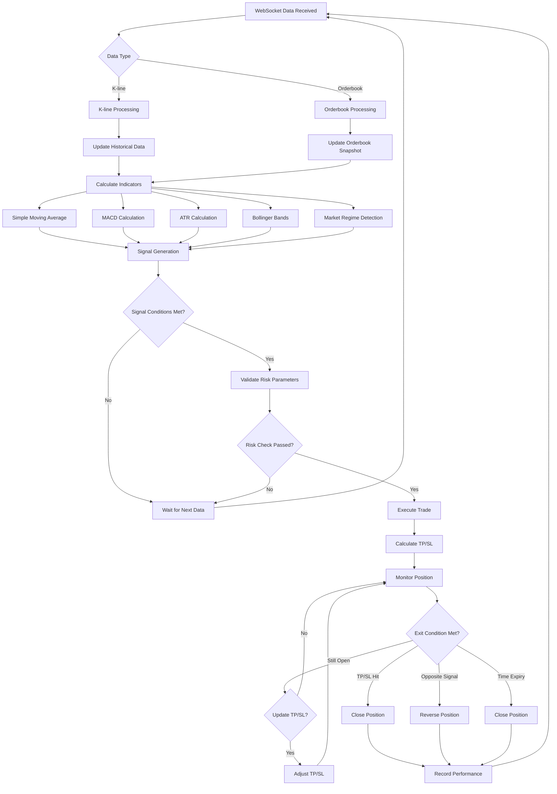
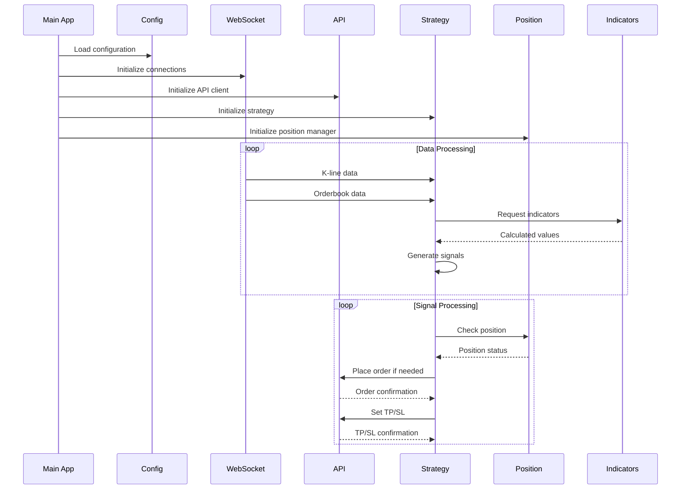
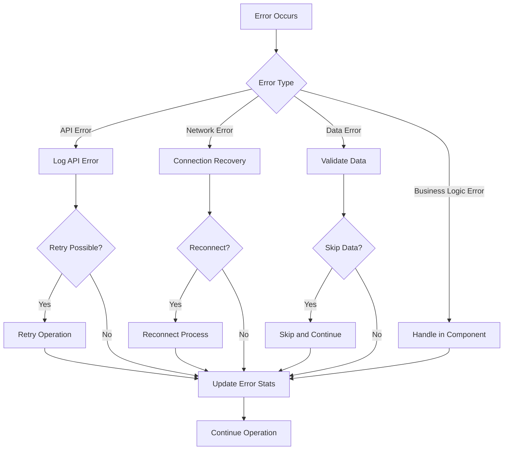

# Trading Bot Architecture & Algorithm Diagrams

## 1. System Architecture

## 2. Package Dependencies

## 3. Trading Algorithm Flow

## 4. Component Interaction Flow

## 5. Error Handling Flow

