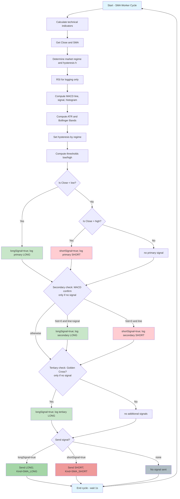

# Signal Generation Algorithm Flow

## Signal Generation Algorithm Summary

### 1. Primary Signals (SMA Crossing)
- LONG: When current close price < SMA * (1 - hysteresis)
- SHORT: When current close price > SMA * (1 + hysteresis)

### 2. Secondary Signals (MACD Confirmation)
- LONG: When MACD histogram > 0 AND MACD line > Signal line
- SHORT: When MACD histogram < 0 AND MACD line < Signal line
- Only evaluated if no primary signal exists

### 3. Tertiary Signals (Golden Cross)
- LONG: When golden cross detected
- Only evaluated if no primary or secondary signal exists

### 4. Hysteresis
- Default: 0.5%
- In trending regime: 1.0% (wider hysteresis)

### 5. Signal Priority
- Only one signal type is sent per cycle
- Priority order: Primary > Secondary > Tertiary
- No signal is sent if conditions are not met

> Note: RSI has been temporarily disabled from signal generation but is still calculated for logging purposes.
